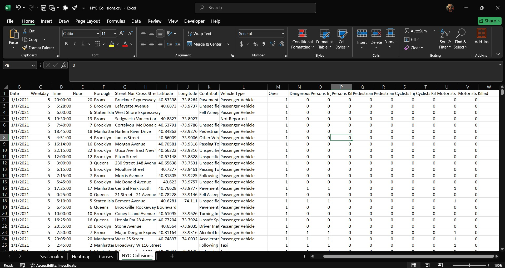
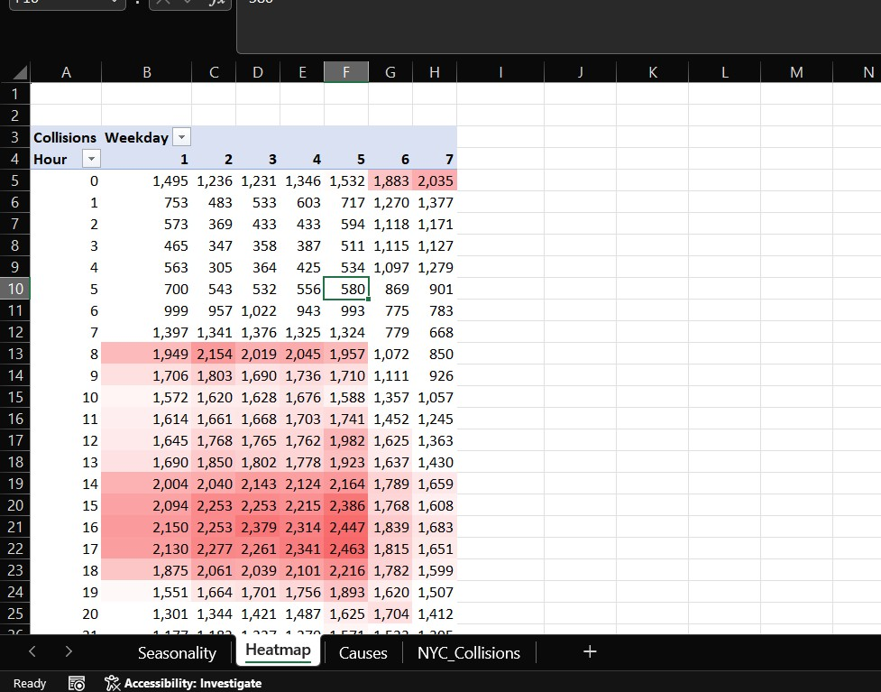
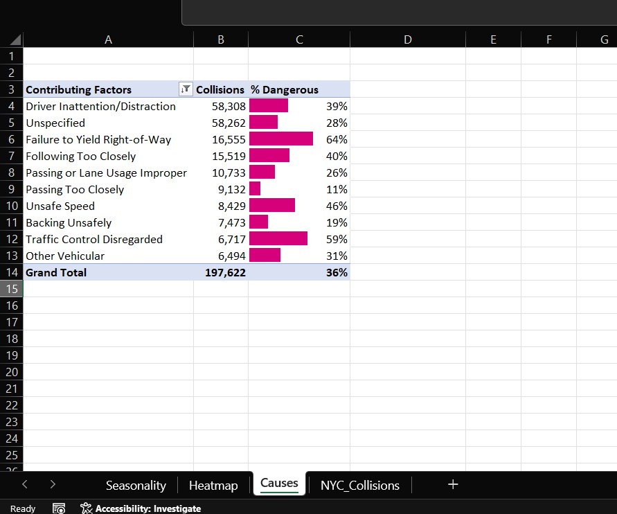
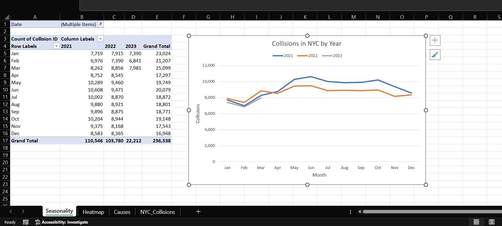

## Maven NYC Traffic Collision Analysis (Excel) — 2021–2023 (Q1)

## Excel dashboard with Power Query–style cleaning steps (in Excel), PivotTables/Charts, conditional formatting heatmaps, and GETPIVOTDATA for dynamic values; ≈230k rows exploring **seasonality**, **timing**, and **causes**.

## Quick View
- Maven Showcase: https://mavenshowcase.com/project/40952

## Dataset
NYC Open Data — Motor Vehicle Collisions (Jan 2021 → Mar 2023), ~**230,000** records after cleaning.

## Tools & Techniques
- Excel PivotTables & PivotCharts
- Conditional formatting (for heatmaps)
- GETPIVOTDATA for dynamic values
- Bar charts, line graphs, and percentage analysis
- Data cleaning and formatting

## Business Questions
- How do collisions vary by **month/year** (seasonality)?
- Which **hours/weekday combinations** are collision hotspots?
- Which **contributing factors** are linked to the most *dangerous* collisions?

## Key Insights (narrative)
- Rushing through NYC at 8 AM or 5 PM? These hours witnessed the highest number of collisions, evident from the heatmap.
- Driver distraction emerged as the primary cause of accidents, emphasizing the severe consequences of diverted attention.
- The most perilous driving behavior? Failure to Yield Right-of-Way, resulting in nearly 2 out of every 3 collisions turning serious.
- Summer wasn't just scorching; it was a danger zone. May to July saw a significant spike in crashes over the three-year period.
- Alarmingly, 36% of NYC collisions were deemed hazardous, underscoring the critical need for enhanced enforcement and educational initiatives.

## Screens

## Build Notes
- Cleaning & formatting (types, trims, null handling, dedupes).
- Derived time parts: **Year, Month, Weekday, Hour**.
- Pivots/Charts for seasonality, hour×weekday heatmap, and % dangerous by cause.

